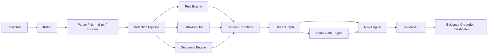

# SENTINEL

### Autonomous Cybersecurity Intelligence & Threat Correlation Engine

> A security telemetry platform for turning noisy, multi-source events into explainable incidents, attack paths, and evidence-backed investigations.

[](#project-status)
[](#why-sentinel)
[](#architecture)

## Why Sentinel

Security teams rarely lack logs. They lack reliable context.

Sentinel is being built to correlate authentication, API, database, container, and infrastructure telemetry into a coherent security narrative. It combines deterministic detection, behavioral machine learning, temporal sequence analysis, and threat-graph algorithms so that an incident is more than an alert: it includes the evidence, affected assets, reachable attack paths, and a defensible risk score.

The project is part of a broader AI/backend portfolio, but Sentinel has a distinct engineering focus: **security-aware AI systems that remain explainable, testable, and operationally observable**.

## Project status

Sentinel is currently in the architecture and foundation phase. The repository starts with the system contract and implementation roadmap; production claims will be added only as they are supported by tests, replayable datasets, benchmarks, and documented failure modes.

Planned evidence includes:

- deterministic replay of benign traffic and controlled attack sequences;
- precision, recall, false-positive, and timeout measurements for detection;
- graph reachability and attack-path correctness tests;
- throughput, latency, and Kafka-lag measurements under load;
- model baselines, evaluation datasets, and per-entity anomaly explanations;
- OpenTelemetry traces, Prometheus metrics, structured logs, and architecture decision records.

## Core capabilities

| Capability | What Sentinel will demonstrate |
| --- | --- |
| Telemetry ingestion | Collect and consume events from multiple security-relevant sources. |
| Event normalization | Convert heterogeneous inputs into a versioned `SecurityEvent` contract. |
| Detection pipeline | Combine rules, behavioral ML, and ordered sequence detection. |
| Behavioral baselines | Model users, service accounts, API clients, and devices. |
| Threat graph | Represent identities, privileges, services, resources, and exposure relationships. |
| Attack-path analysis | Calculate reachability, weighted routes, choke points, cycles, and permission diffs. |
| Incident risk | Rank incidents using evidence-weighted, explainable factors. |
| Investigation layer | Produce typed, evidence-grounded hypotheses with event and graph references. |

## Architecture



The frontend is intentionally secondary. It will expose and demonstrate the system; the primary engineering evidence lives in the schemas, services, algorithms, evaluation harnesses, and operational telemetry.

## Security event contract

Every source is normalized into a stable, versioned event shape:

```text
SecurityEvent
├── event_id
├── timestamp
├── actor_id / actor_type
├── source_ip
├── device_id
├── action / resource / result
├── attributes{}
├── severity
├── source
└── schema_version
```

Versioned schemas and idempotency keys are foundational requirements. They make ingestion replayable, correlation deterministic, and downstream changes reviewable.

## Detection and reasoning

### Behavioral anomaly detection

Entity baselines will use features such as login time, region, device fingerprint, endpoint frequency, request rate, response size, transferred bytes, permission usage, and failure counts. Candidate models include Isolation Forest, Local Outlier Factor, One-Class SVM, and an optional autoencoder.

An anomaly result must include both a score and the dimensions that contributed to it. A model is not considered complete without a baseline, evaluation dataset, latency measurement, and documented failure modes.

### Sequence detection

Sentinel will detect bounded, ordered patterns such as:

```text
FAILED_LOGIN* → SUCCESSFUL_LOGIN → ROLE_CHANGE
→ SENSITIVE_RESOURCE_ACCESS → LARGE_EXPORT
```

Finite-state machines provide deterministic matching; sliding windows and event-time watermarks bound correlation; tries/automata will share work across signatures with common prefixes.

### Threat graph algorithms

The graph models users, credentials, devices, IPs, roles, permissions, APIs, services, containers, databases, tables, secrets, and repositories. It supports:

- BFS/DFS reachability and blast-radius analysis;
- weighted shortest paths for least-resistance attack routes;
- centrality analysis for high-value choke points;
- strongly connected component detection for privilege loops;
- graph diffs that identify newly exposed assets after permission changes.

### Evidence-grounded investigation

The investigation layer receives only evidence selected by deterministic and ML services. Its tools will include event lookup, graph-path queries, baseline queries, rule explanations, and runbook retrieval. Responses will use typed JSON and every material statement must reference supporting event IDs or graph paths.

## Planned technology map

| Area | Planned technology | Role |
| --- | --- | --- |
| Services and APIs | Python / FastAPI | Ingestion, detection, investigation, and HTTP APIs |
| Event transport | Kafka or Redpanda | Durable, decoupled telemetry processing |
| Transactional data | PostgreSQL | Incidents, rules, identities, and audit records |
| Graph data | Neo4j | Permissions, relationships, and attack paths |
| Hot state | Redis | Entity profiles, windows, and rate-limit state |
| Raw/archive data | S3-compatible object storage | Raw logs and model artifacts |
| Observability | Prometheus + OpenTelemetry | Metrics, traces, and operational diagnosis |
| Delivery | Docker + GitHub Actions | Reproducible development and quality gates |

Technology choices may change as benchmarks and operational constraints provide evidence. Architecture decisions will be recorded rather than implied by implementation details.

## Roadmap

- [x] Define schemas, repository boundaries, and local development environment
- [ ] Build collectors, normalization, Kafka transport, and replayable fixtures
- [ ] Implement rule detection and incident aggregation
- [ ] Add threat graph ingestion, reachability, and attack-path queries
- [ ] Add entity baselines and behavioral anomaly evaluation
- [ ] Implement FSM/sliding-window sequence correlation
- [ ] Add evidence-weighted risk scoring and audit records
- [ ] Add typed investigation workflows and runbook retrieval
- [ ] Add observability, load tests, replay guarantees, and a demonstration console

## Engineering standards

Sentinel is measured by engineering evidence, not feature count.

- Health, readiness, and metrics endpoints are part of the service contract.
- Critical paths use integration tests with real infrastructure containers where practical.
- Deterministic code owns critical calculations; AI outputs are validated against typed schemas.
- Correlation is idempotent and replayable.
- Algorithm-heavy components include correctness tests, complexity notes, and reproducible benchmarks.
- CI will include linting, type checking, unit tests, integration tests, and benchmark regression checks where applicable.
- Logs are structured, traces are correlated, and security-sensitive actions are auditable.

## Repository layout

```text
sentinel/
├── services/          # ingestion, detection, graph, risk, and investigation services
├── algorithms/        # sequence and attack-path algorithms
├── ml/                # training, inference, and evaluation
├── schemas/           # versioned event and API contracts
├── infrastructure/    # Docker, deployment, and monitoring assets
├── tests/              # unit, integration, contract, performance, and e2e tests
├── benchmarks/        # reproducible throughput, latency, and algorithm benchmarks
└── docs/               # architecture, ADRs, security, API, and operations documentation
```

## Portfolio context

Sentinel is the security-aware AI/backend system in a five-project portfolio alongside AEGIS, NEXUS, ATLAS, and NEBULA. Its role is deliberately different: it combines streaming systems, behavior modeling, temporal algorithms, graph reasoning, and explainable investigation into one security-focused capstone.

## Author

Built by [Bishrav](https://github.com/Bishrav) as a personal engineering portfolio project.

The repository is intentionally public so the design decisions, implementation progress, test evidence, and trade-offs can be reviewed as the system evolves.
