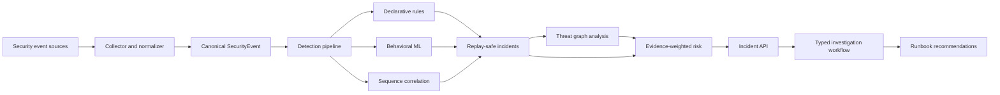

# Sentinel

### Security telemetry correlation and evidence-grounded investigation

Sentinel is a portfolio-scale backend and AI systems project for turning noisy security telemetry into explainable incidents, attack-path signals, risk assessments, and investigation-ready evidence.

It demonstrates versioned contracts, deterministic correlation, behavioral anomaly detection, graph algorithms, replay safety, operational metrics, and validated investigation workflows.

> Portfolio status: complete local engineering project. Sentinel is intentionally not presented as a hosted production service or as having real customer traffic.

## Why this project is technically interesting

Security signals are rarely useful in isolation. A failed login, an unusual access pattern, a privilege change, and a reachable sensitive resource become meaningful only when they can be correlated without losing provenance.

Sentinel combines deterministic and statistical techniques so important results can be inspected, tested, replayed, and explained:

- ordered event sequences use finite-state correlation and event-time watermarks;
- behavioral anomalies preserve contributing feature evidence;
- threat-graph analysis exposes reachability, weighted paths, centrality, cycles, and permission changes;
- incident risk uses a versioned weighted formula rather than an opaque score;
- investigation responses use typed contracts and reject unsupported citations;
- replay and benchmark checks are part of the repository quality gates.

## System architecture



The critical path is deterministic and dependency-light. Optional adapters provide SQLite persistence, API-key authentication, and an external investigation-provider boundary without making local development depend on hosted infrastructure.

## Implemented capabilities

### Ingestion and detection

- Canonical, versioned `SecurityEvent` contracts.
- JSONL collection and deterministic replay fixtures.
- Declarative rule conditions with safe operators.
- Replay-safe incident aggregation and deterministic incident IDs.
- Optional Kafka/Redpanda transport boundary through the ingestion service.

### Behavioral ML

- Per-entity behavioral feature extraction.
- Replay-safe online baselines using numerically stable statistics.
- Explainable z-score anomaly scoring.
- Isolation Forest adapter with model persistence.
- Evaluation, comparison, and versioned artifact workflows.

### Sequence and graph intelligence

- Finite-state sequence matching with sliding windows.
- Event-time watermarks, allowed lateness, duplicate protection, and bounded state.
- BFS/DFS reachability and weighted shortest paths.
- Degree centrality, strongly connected components, attack-path assessment, and permission graph diffs.

### Risk and investigation

- Evidence-weighted risk scoring with versioned formula `1.0`.
- Risk bands, component breakdowns, and immutable audit records.
- Typed investigation requests and responses.
- Citation integrity validation for every hypothesis.
- Deterministic runbook recommendations based on evidence types.
- Optional HTTP provider adapter with grounding checks, retries, backoff, and metrics.

### Operational engineering

- SQLite-backed incident persistence with WAL mode.
- Opt-in Bearer API-key authentication and investigator/operator/admin roles.
- `/health`, `/ready`, and Prometheus-compatible `/metrics` endpoints.
- Unit, integration, contract, replay, benchmark, and CI quality checks.
- Local demonstration console for investigation preparation.

## Local quick start

### Requirements

- Python 3.12+
- [uv](https://docs.astral.sh/uv/)
- Docker Desktop only when running the optional local infrastructure stack

### Install and validate

```bash
uv sync --dev
uv run pytest
uv run ruff check .
uv run ruff format --check .
uv run mypy
```

### Run the API locally

```bash
uv run uvicorn sentinel_api.main:app --app-dir services/api/src --reload
```

Useful endpoints:

- `http://localhost:8000/docs` - interactive OpenAPI documentation
- `http://localhost:8000/health` - liveness check
- `http://localhost:8000/ready` - local runtime configuration state
- `http://localhost:8000/metrics` - ML, sequence, and provider metrics

### Run the investigation demonstration

```bash
uv run sentinel-investigate-demo
```

The demo reads `tests/fixtures/investigation_evidence.json`, prepares a deterministic investigation response, and prints matching runbook recommendations. It intentionally generates no unsupported AI hypotheses.

### Optional local infrastructure

```bash
docker compose -f infrastructure/docker/compose.yaml up -d
```

Stop it with:

```bash
docker compose -f infrastructure/docker/compose.yaml down
```

## Optional runtime configuration

Local development works without these settings. They are documented for reproducibility and deployment experiments; no secrets are committed.

```text
# Durable incident projections
SENTINEL_INCIDENT_DB_PATH=./sentinel.db

# API authentication: key:role pairs
SENTINEL_API_KEYS=investigator-key:investigator,operator-key:operator

# External investigation provider boundary
SENTINEL_INVESTIGATION_ENDPOINT=https://provider.example/investigate
SENTINEL_INVESTIGATION_API_KEY=<secret>
SENTINEL_INVESTIGATION_TIMEOUT_SECONDS=10
SENTINEL_INVESTIGATION_MAX_RETRIES=2
SENTINEL_INVESTIGATION_BACKOFF_SECONDS=0.25
```

The repository provides the provider contract and adapter, but does not claim that a specific external provider is live. That decision belongs to whoever runs the system.

## Engineering evidence

The project favors inspectable evidence over vanity counters:

| Area | Evidence |
| --- | --- |
| Sequence correlation | [`sequence-fsm.md`](docs/architecture/sequence-fsm.md), replay tests, benchmark, CI smoke check |
| Risk scoring | [`risk-scoring.md`](docs/architecture/risk-scoring.md), weighted components, audit record tests |
| Investigation safety | [`investigation-contracts.md`](docs/architecture/investigation-contracts.md), citation validation tests |
| Provider operations | [`investigation-provider.md`](docs/operations/investigation-provider.md), retries, metrics, replay validation |
| Phase validation | [`phase-5-validation.md`](docs/operations/phase-5-validation.md), [`phase-6-validation.md`](docs/operations/phase-6-validation.md) |
| Local operation | [`local-development.md`](docs/operations/local-development.md), [`demo-console.md`](docs/operations/demo-console.md) |

Benchmark numbers in this repository are local engineering signals only. They are not production throughput or latency claims.

## Repository layout

```text
services/
  api/             FastAPI surface, readiness, metrics, and route authorization
  detection/       Rules, anomaly integration, sequence-to-incident aggregation
  graph/           Threat graph models and algorithms
  ingestion/       Collection, normalization, replay, and transport boundaries
  investigation/   Typed workflows, runbooks, provider adapter, and demo CLI
  ml/              Features, baselines, scoring, evaluation, and persistence
  risk/            Explainable evidence-weighted risk engine
  sequence/        Finite-state temporal correlation
  storage/         SQLite incident persistence
schemas/           Versioned JSON contracts
tests/             Unit, contract, integration, replay, and performance tests
benchmarks/        Reproducible local benchmark workloads
docs/              Architecture, operations, API notes, and validation evidence
infrastructure/    Optional Docker Compose development infrastructure
```

## Project status and next direction

Phases 0 through 6 are complete for the local portfolio implementation. Optional future extensions include a chosen external provider, a shared production database adapter, centralized secret rotation, and infrastructure-specific deployment manifests.

## Portfolio context

Sentinel is Bishrav Shiwakoti's security-focused backend and AI systems project. It is intentionally distinct from a generic CRUD or frontend portfolio project: the emphasis is on correlation semantics, failure handling, explainability, replayability, and production-minded interfaces.

## Author

Built by [Bishrav Shiwakoti](https://github.com/Bishrav) as a personal engineering portfolio project.
